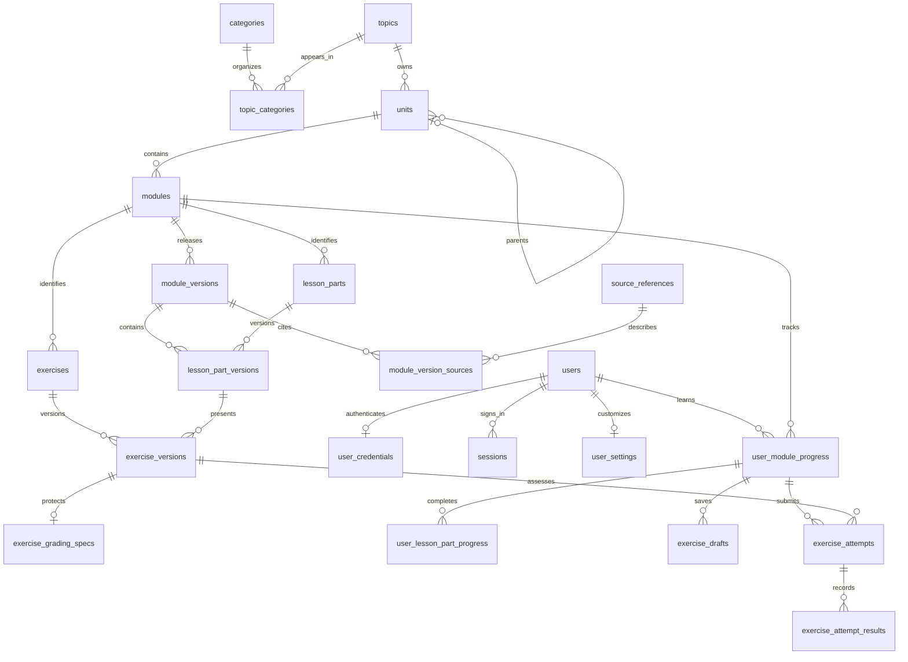

# Database schema

Alexandria uses one local SQLite database with foreign keys, strict tables, WAL journaling, full synchronous writes, and a busy timeout. Schema changes run through explicit, checksummed migrations. Application startup verifies migration history; it does not initialize or upgrade storage implicitly. See [Getting started](getting-started.md) for initialization, backup, and migration commands.

The schema supports accounts, the library catalog, versioned curriculum, and sparse learner progress. Only the three library categories and instance metadata are initialized. Database initialization does not seed accounts, topics, units, modules, lessons, exercises, attempts, or progress records. The separate `content:import -- cpp` command imports the expanded C++ hierarchy from JSON; `content:cpp-basics` remains a compatibility alias. `content:import -- --all` imports the full [curriculum catalog](curriculum-map.md) in one transaction after a backup. The original seven [C++ Basics lessons](cpp-basics-content.md) keep their stable module and part identities; corrections publish new versions while retaining existing releases.

## Migration history

| Migration | Responsibility |
| --- | --- |
| `0001_library_foundation` | Instance identity, categories, topics, and category placement; preserved unchanged from the first release. |
| `0002_identity` | Local account identity, protected credentials, sessions, and user settings. |
| `0003_curriculum` | Unit hierarchy, module releases, lesson and exercise identities/content, private grading specifications, and bibliographic citations. |
| `0004_progress` | Module progress, completed lesson parts, exercise drafts, immutable submissions, and grading history. |
| `0005_catalog_revisions` | Revision counters for existing categories/topics and administrator API conflict detection. |
| `0006_learning_goals` | Sparse per-user weekly module targets (1–14), defaulting to 3 until changed. |

Each migration and its history entry commit together. Existing installations must use `db:migrate`; `db:init` refuses to overwrite an existing database. Published migrations must never be edited after deployment: add a new migration instead.

## Relationships

The diagram summarizes relationships; composite foreign keys additionally enforce module and version ownership at every learner reference.

## Tables

### Instance and discovery

| Table | Key and stored data |
| --- | --- |
| `instance_metadata` | A singleton with stable instance ID and creation time; distinguishes this installation and its backups. |
| `schema_migrations` | Migration ID, SHA-256 SQL checksum, and application time. |
| `categories` | Stable ID, globally unique slug, name, description, position, status, revision, and timestamps. |
| `topics` | Stable ID, globally unique slug, name, description, status, revision, and timestamps. |
| `topic_categories` | Composite key `(topic_id, category_id)` and display position. A topic can appear in multiple categories. |

The library repository exposes only published topics with a published category placement. Removing a placement does not remove its topic. Discovery ordering is stable, including ID tie-breakers.

### Accounts and settings

| Table | Key and stored data |
| --- | --- |
| `users` | UUID text ID, unique normalized username, display name, `admin`/`member` role, `active`/`disabled` status, and timestamps. |
| `user_credentials` | One protected password hash per user and update time. Passwords are not stored as plaintext. |
| `sessions` | Hashed session token as key, user ID, CSRF token, creation and expiry times. Session timestamps are Unix milliseconds and lifetimes are bounded to seven days. |
| `user_settings` | Optional row keyed by user: `theme` (`system`, `light`, `dark`), `text_size` (`small`, `medium`, `large`), `motion_preference` (`system`, `reduced`, `full`), revision, and update time. |

Missing settings use application defaults. Identity and progress reference internal user IDs, independent of display names. The server authorizes account reads and writes; SQL foreign keys alone do not provide per-user access control.

### Curriculum and content

| Table | Key and stored data |
| --- | --- |
| `units` | Stable ID, owning topic, optional parent unit, name, topic-unique slug, description, position, status, and timestamps. Subunits are ordinary units with a parent. |
| `modules` | Stable ID, primary unit, title, unit-unique slug, summary, position, required flag, status, and timestamps. |
| `module_versions` | Release ID, owning module, positive module-local version number, title/summary snapshot, `draft`/`published` status, content schema version, objectives array, completion policy object, revision, timestamps, and publication time. |
| `lesson_parts` | Stable part ID and owning module. The identity can be reused across releases. |
| `lesson_part_versions` | Key `(lesson_part_id, module_version_id)`, owning module, title, position, required flag, and structured content array. |
| `exercises` | Stable exercise ID and owning module, reused across releases. |
| `exercise_versions` | Assessed exercise version ID, stable exercise ID, module/version/lesson ownership, kind, public prompt, public response schema, grading method, position, and required flag. One occurrence of an exercise per module version. |
| `exercise_grading_specs` | One server-only specification object and solution object per exercise version. These are separate from public prompt/content fields. |
| `source_references` | Bibliographic title, author array, publisher, year, edition, ISBN, DOI, and optional HTTP(S) URL. |
| `module_version_sources` | Key `(module_version_id, source_reference_id)`, bibliographic locator such as a chapter or page range, and position. |

Catalog statuses are `draft`, `published`, and `archived`; published content versions themselves have no mutable archive status. Archive a module to change catalog availability while retaining its published releases and learning history.

Exercise kinds currently reserved by the schema are `choice`, `structured`, `text`, `numeric`, and `code`; grading methods are `automatic`, `manual`, and `self_review`. These values establish storage boundaries. They do not implement exercise interfaces, code execution, mathematical equivalence checking, or grading.

There are no columns for private source-book file paths, book uploads, or extracted source text. Source books remain outside application storage and backups. Bibliographic URLs accept HTTP(S), rejecting `file:` links. A source cited by a published release cannot be edited; create a corrected bibliographic record for a new release.

### Learner state and history

| Table | Key and stored data |
| --- | --- |
| `user_module_progress` | Key `(user_id, module_id)`, `in_progress`/`completed`, start/activity timestamps, last module version and optional stable lesson part, historical completion version/time, and revision. Absence means not started. |
| `user_lesson_part_progress` | One immutable completion per `(user_id, module_version_id, lesson_part_id)`, with module ownership and completion time. A resume bookmark does not imply completion. |
| `exercise_drafts` | Key `(user_id, exercise_version_id)`, owning module/version, response object, revision, and update time. Only entered work creates a row; drafts can be discarded. |
| `exercise_attempts` | Immutable attempt ID, user/module/version/exercise ownership, user-scoped submission key, response object, submission time, optional time spent, hint count, and solution-viewed flag. |
| `exercise_attempt_results` | Append-only grading events keyed by `(attempt_id, sequence)`, status, outcome, optional normalized score, feedback object, infrastructure error code, and recorded time. |

A submission without grading events is pending. The most recent sequence supplies its current grading state. Events can record running, failed, and graded states without changing submitted work. A failed event requires an infrastructure error code and has no assessment outcome. A graded event requires `correct`, `incorrect`, `partial`, or `reviewed`; it cannot also be an infrastructure failure. A final grade ends that attempt's grading history. An intentional learner retry receives a new attempt ID and submission key.

## Enforced invariants

- **Hierarchy:** A unit's parent belongs to the same topic. Self-parenting and longer cycles are rejected by database triggers, including when foreign keys are deferred inside a transaction. Unit identity and topic ownership cannot change. Move a unit within its topic by changing its parent. Cross-topic subtree migration needs a separate future operation.
- **Ordering and ownership:** Positions are nonnegative. Equal positions are valid; queries order by position and stable ID. Composite keys prevent a lesson, exercise, resume point, completed version, draft, or attempt from being combined with another module's content.
- **Publication:** A version starts as draft revision 1. Publishing requires at least one lesson part and a private grading specification for every exercise. A module needs a published version before its catalog status can become published. Published versions, lesson content, exercise content, specifications, and citation associations reject inserts, changes, or deletions that would alter that release. New draft releases reuse stable identities without rewriting old releases.
- **Progress:** Learner state references published versions. Start time is preserved, activity time cannot move backward, and revisions advance exactly once per update. Completion requires a version and a time between start and latest activity. Once completed, status and completion evidence cannot regress or be replaced; a later resume may point at a newer published version.
- **Sparse detail:** Lesson completions, drafts, and attempts require an existing module-progress row. Their timestamps cannot precede the module start. Completed lesson parts and submitted attempts are immutable.
- **Idempotency and concurrency:** `(user_id, submission_key)` uniquely identifies one submission. Repeated inserts are rejected, including replacement attempts. A future submission service must read and return the existing attempt for an identical retried request, and reject reuse with different input. Revision-based draft writes use `UPDATE ... WHERE revision = ?`; zero changed rows means the client used a stale revision. Explicit reading completion uses a transaction under SQLite’s write lock, advances the stored revision, and returns existing evidence on identical retries. Related draft/submission/progress changes belong in one transaction.
- **Grading history:** Sequences advance from 1 without gaps, event times do not precede submission or previous events, and a final grade cannot be changed. Submissions and grading events reject updates and deletes. The schema supports later asynchronous grading without executing learner code in SQLite or the API process.
- **Deletion:** Foreign keys use restrictive deletion for owned content and learning records. Archive published catalog content instead of deleting it. Account deletion and history retention need an explicit product policy; no cascade silently erases learner history.

Normal database connections enable recursive triggers. Additional insertion guards prevent SQLite `INSERT OR REPLACE` from bypassing immutable attempts, lesson completions, completion state, or draft revisions even if a caller disables recursive triggers.

All new curriculum/progress timestamps are validated date-time text; chronological comparisons use SQLite date functions. Objects and arrays are checked for valid JSON and top-level shape. These checks complement content-file and public-reader validation; they do not replace grading validation or server authorization.

## Deferred interfaces and decisions

Published curriculum reading, a shared unit/module UI, and JSON content import are implemented. Unit folders describe the hierarchy and individual module files contain the structured lessons and citations. `content:check` validates files and cross-topic identities without database access; `content:import` backs up and adds a named root or all roots transactionally. The curriculum expansion uses the existing schema, requires no migration, and leaves matching published records unchanged.

Module JSON supplies a stable module ID, a release `versionId`, and an optional positive `version` (default 1). Revisions use a new release ID and the next sequential version number. The importer reuses unchanged stable identities and source metadata, creates and publishes a new version, and preserves old releases and progress. Corrected bibliographic metadata requires a new source ID. Exact latest-version reruns make no curriculum writes; conflicting, skipped, or older releases fail atomically. Fresh installations may start at the selected version without reconstructing historical releases. Authoring/publishing endpoints and grading workers remain deferred. The optional C++20 code area runs visit-local experiments in isolated containers without writing to exercise or submission tables. Reading progress endpoints use the existing module and lesson-part tables; XP is derived from distinct stable section identities and first module completions. The additive `user_learning_goals` table stores only the chosen weekly target and update time. See [Content authoring](../content/README.md) for the file format and constraints.

The reader currently supports validated paragraph, code, list, callout, and reflection blocks. Before authoring and learner interfaces are added, define the completion policy, validate private grading specifications, and authorize all learner operations from the authenticated account. Authoring changes to draft child rows should run in a transaction that checks and advances the parent version revision. Public content serializers must explicitly omit protected grading specifications and solutions.

The public outline and module repositories require a published topic with a published category placement, a published module version, and every ancestor unit to be published. The library endpoint lists topics; the curriculum endpoints provide outlines and validated lesson content.

Unit and topic coverage should be derived from applicable required modules, including descendants, counting each module once. Untouched modules remain in the denominator; empty curricula have no required modules rather than automatic completion. Historical completion is retained separately from current coverage when required content changes. No per-user unit/topic totals, topic enrollment, prerequisites, achievement snapshots, or separate assistance-event tracking are added yet.

Integration tests in `server/db/curriculum.test.ts` exercise fresh initialization, multi-level and deferred cycles, foreign-key ownership, draft publication and immutability, competing writer revisions, completion preservation, request duplication, grading history, and transaction rollback against actual SQLite databases.
