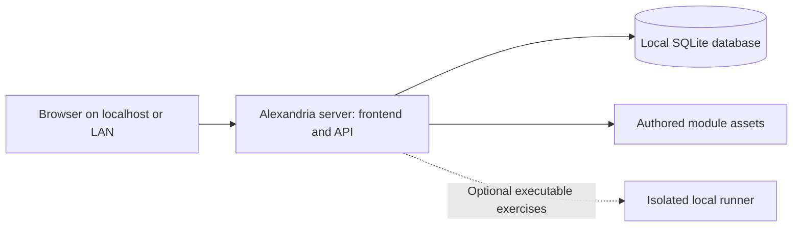

# Alexandria: Fully Self-Hosted Implementation Plan

Status: Planning draft. Fully self-hostable operation with no required cloud services is an agreed requirement. Local SQLite is the proposed initial database. Deployment files, commands, and configuration names below are implementation targets, not existing features.

## 1. Goal and scope

Alexandria must run on a user-controlled machine and remain usable when that machine has no internet access. Browsers can connect over localhost or a private network. Accounts, authored curriculum, application assets, submissions, settings, and progress remain on storage controlled by the operator.

The initial deployment uses one application server with an embedded SQLite database and local file storage. Docker is optional. Neither Turso Cloud nor a separate database service is required.

The repository currently contains product and schema planning in `notes/`, with no application implementation found during this review. This is primarily an architecture change before implementation, not a migration of a verified live Turso database.

Related plans:

- [Modules and learning experience](../notes/modules.md)
- [Catalog and units schema](../notes/units-database.md)
- [Users and learning progress](../notes/user-progress.md)

## 2. Architectural decisions

| Area | Initial direction |
| --- | --- |
| Frontend | Retain the planned Vite, React, TypeScript, and Anime.js stack |
| Backend | One server serving the built frontend and API on one origin; runtime/framework selected during implementation |
| Database | Embedded SQLite on a local filesystem |
| Database access | Server-owned connection layer and versioned SQL migrations |
| Files | Local managed directory for authored application assets; source books remain outside the application |
| Authentication | Local accounts and server-managed sessions; no external identity provider required |
| Deployment | Direct process under a service manager, plus optional Docker Compose packaging |
| Background work | In-process bounded jobs initially; isolated local runner only when executable exercises ship |
| Backups | Local backup workflow with an additional copy on another operator-controlled device |
| External services | No mandatory analytics, CDN, email service, object storage, AI API, or hosted queue |

Choose a maintained SQLite driver compatible with the selected server runtime. It must support prepared statements, transactions, connection configuration, migrations, and consistent backups. An ORM is optional; avoid building a multi-database abstraction before there is a demonstrated need.

Self-hosting a separate libSQL service adds another process without an initial requirement for it. Use embedded SQLite as the baseline. Reassess self-hosted Postgres if measured write contention or a requirement for multiple application hosts justifies it.

## 3. Runtime topology



The browser never opens the database directly. The server enforces authorization, grades supported exercises, and persists progress. Multiple browsers can use the same instance and account without any cloud synchronization; they all connect to the same server.

Initial scope supports one active application instance per data directory. Multiple hosts must not share the SQLite file. Host failure causes downtime until that host recovers or a backup is restored elsewhere; automatic failover is outside the first release.

No-internet operation does not imply that a browser can save progress while disconnected from the Alexandria server. Browser-offline synchronization is a separate future feature.

## 4. Repository and storage layout

Planned repository structure:

```text
client/src/             Application composition and feature modules
client/src/components/ui/ Reusable UI components
client/src/styles/      Shared design tokens and application styles
shared/                 Public contracts and validated content schemas
server/
  db/                   Connection setup, repositories, migrations
  services/             Accounts, catalog, grading, progress, storage
  commands/             Initialization, migrations, backup and restore
deploy/                 Docker and service-manager examples
docs/                   Architecture and operator documentation
```

Example persistent host layout:

```text
/srv/alexandria/
  data/
    database/alexandria.sqlite
    assets/
    tmp/
  backups/
  config/
```

These paths are examples and must be configurable. Keep runtime data outside the application checkout and container image. Exclude databases, WAL files, backups, secrets, and source books from Git.

Put the active database on reliable local storage, preferably the server's internal disk. SQLite WAL requires processes to use the same host and does not support a database on a network filesystem. [SQLite WAL documentation](https://www.sqlite.org/wal.html)

Source books are private references used during module authoring, not application content. The Software, AI, and Mathematics directories on the external drive remain outside application storage. Do not copy, import, mount, serve, distribute, or back up those books through Alexandria. The deployed server does not need access to them.

Publish independently authored explanations, exercises, and application assets. Source references may contain bibliographic metadata such as title, author, edition, and page references; they must not embed book files, scans, extracted full text, or private filesystem paths. Any temporary source-processing material belongs outside application data, release artifacts, and backup inputs. Ownership of the reference books does not grant the project permission to distribute them.

Published modules must remain fully usable when the private reference drive is disconnected. If the database volume is missing, fail startup instead of silently creating an empty replacement database. Database creation must be an explicit initialization operation.

## 5. SQLite connection and consistency policy

Proposed settings, to verify with the chosen driver:

```sql
PRAGMA foreign_keys = ON;
PRAGMA journal_mode = WAL;
PRAGMA synchronous = FULL;
PRAGMA busy_timeout = 5000;
```

Enable and verify foreign-key enforcement on every connection before transactions begin. Configure connection-scoped durability and busy handling for every connection as well; check that journal mode is actually WAL. The timeout is an initial tuning value, not a performance guarantee. [SQLite foreign keys](https://www.sqlite.org/foreignkeys.html), [SQLite PRAGMA reference](https://www.sqlite.org/pragma.html)

Keep writes short and atomic. Do not hold a transaction open during asset processing, code execution, or other slow work. SQLite WAL supports concurrent readers with a single writer; handle lock contention with bounded retries only when the operation can be retried safely. [SQLite WAL documentation](https://www.sqlite.org/wal.html)

Use parameterized statements, database constraints, and indexes aligned with actual queries. Preserve the existing plans for stable IDs, versioned content, sparse learner progress, and immutable attempt history. Enforce submission idempotency with a uniqueness constraint, and apply related attempt/progress changes within a transaction.

Define an explicit conflict policy for drafts and resume positions before implementing competing browser sessions. A stale update must not overwrite completed status. Use revision checks for mutable drafts so conflicts can be surfaced instead of silently discarding newer work.

## 6. Schema and migration plan

Build the schema in this dependency order:

1. Migration history, local users, credentials, and sessions.
2. Categories, topics, topic-category associations, units, and modules.
3. Published module versions, lesson parts, exercise versions, and source references.
4. User settings, module progress, attempts, and any required draft records.
5. File metadata and optional durable job records when those features need them.

Carry forward catalog rules: same-topic unit parents, no cycles, deterministic ordering, and restrictive deletion of learning history. Validate version ownership for progress and submissions. Use database constraints wherever practical and transactional service validation for rules such as hierarchy cycles.

Each migration has an immutable identifier and checksum recorded in a migration table. Run migrations through one explicit maintenance command before starting a new release. Prevent concurrent migration runs, back up existing data first, and reject an unsupported schema at server startup.

Test migrations from an empty database and every supported prior release fixture. A failed migration must leave a known recoverable state. Use transactions where supported; separately document any operation that cannot be rolled back. Do not automatically run destructive down migrations during rollback.

If an existing Turso deployment is discovered later, inventory its schema, row counts, files, and any libSQL-specific features before export. Stop source writes for the final transfer, import into a separate local database, validate relationships and application flows, and retain the source until cutover is verified. This is conditional work, not a prerequisite for a fresh install.

## 7. Local identity and file access

Provide an explicit local command to create the first administrator without default credentials or a public setup race. Use a maintained password-hashing implementation and server-side sessions. Account creation, sign-in, sign-out, and administrator-assisted password recovery must work without email or internet access.

Authorize every account, progress, submission, and protected-file request on the server. Keep sessions and private solutions out of public frontend payloads. Include session expiration, login throttling, and protection for state-changing browser requests. Final authentication library and password parameters are implementation decisions to validate when selected.

Managed application-asset uploads receive server-generated storage names. Validate containment within the managed asset directory, including symlinks, and reject path traversal. Source-book uploads and book-serving endpoints are outside application scope. An imported application asset must not cause arbitrary server code execution. Serve user-controlled content using appropriate content types and download behavior.

A database transaction does not atomically commit filesystem changes. Stage uploads, validate them, atomically rename them into managed storage on the same filesystem, then commit their metadata. Define cleanup for orphan files and recovery for interrupted imports. Published assets should be immutable or versioned so existing lessons retain their references.

## 8. Configuration contract

Proposed environment variables:

| Variable | Purpose / example |
| --- | --- |
| `HOST` | Direct-run default `127.0.0.1`; container listener `0.0.0.0` |
| `PORT` | Application port, for example `3000` |
| `APP_ORIGIN` | Canonical browser origin used for URL and request validation |
| `DATA_DIR` | Absolute persistent data directory |
| `DATABASE_PATH` | Absolute SQLite path within the data directory |
| `ASSET_DIR` | Absolute managed-asset directory |
| `BACKUP_DIR` | Local backup destination outside the live data directory |
| `SESSION_SECRET_FILE` | Protected file containing session secret material |
| `LOG_LEVEL` | Operator-selected logging verbosity |

Do not require `TURSO_DATABASE_URL` or `TURSO_AUTH_TOKEN`. Provide an example configuration with placeholders and startup validation for paths, permissions, and required secrets. Never print secret values in errors or logs.

## 9. Deployment workflows

### Direct server process

1. Install or transfer a supported release and its runtime dependencies.
2. Create persistent directories owned by a dedicated service account.
3. Configure application data paths, origin, and secrets. Do not register or mount source-book directories.
4. Explicitly initialize the database, apply migrations, and create an administrator.
5. Start the production server under the host's service manager.
6. Verify readiness, sign-in, content access, progress persistence, and restart recovery.

Ship an example service definition with restart behavior, a configured working directory, and graceful shutdown. Serve the compiled frontend from the backend in production; development may run Vite and the API separately.

### Optional Docker Compose

Provide one application service built from the same release. Mount the entire data directory persistently so SQLite sidecar files are included. Mount secrets separately. Do not mount source-book directories or include them in the image build context. Match ownership to the container's non-root user and document UID/GID setup.

Bind the published port to localhost by default, with an explicit LAN configuration example. Include readiness checks and restart behavior. Recreating the container must retain all user data. Do not add a Turso, Postgres, Redis, or cloud-agent service to the default Compose file.

### Network and offline operation

Support localhost and LAN deployment without a public domain. For access beyond localhost, document operator-controlled HTTPS, including a private certificate authority for offline networks. A local reverse proxy is optional. Public DNS, public certificate issuance, and external identity services must not be prerequisites.

Bundle frontend scripts, fonts, icons, math rendering, and other required assets locally. Core learning and grading must not depend on remote AI services. Optional future integrations must be disabled by default and have an explicit local alternative or a clearly separate optional feature boundary.

A normal source build may download dependencies. To support installation on a disconnected machine, document how to transfer a prepared release/runtime bundle or exported container image and verify its checksum. Starting or using that prepared release must not download packages, contact a license server, or pull assets from a CDN.

## 10. Backup and restore

Initial proposed schedule: nightly backups and a backup before each upgrade. Retain seven daily and four weekly successful sets, configurable by the operator. With nightly backups, the target maximum loss is approximately one day of changes when backups are healthy. Recovery duration must be measured on actual application data rather than promised in advance.

A backup set contains only the application database snapshot, authored managed assets, application configuration, application version, migration version, a manifest, and checksums. Include protected secrets through a secured backup path, or explicitly document replacement and session invalidation. Source books and temporary source-processing material are explicitly excluded. Use an allowlist of application backup inputs; never recursively collect external reference directories or follow asset symlinks into them. Restoring Alexandria must not require the source books.

For the first implementation, favor a maintenance window that pauses all mutations and background jobs while collecting a consistent set. Use SQLite's backup API for the database snapshot. Copying only the live main database file is not a valid backup strategy in WAL mode. [SQLite backup API](https://www.sqlite.org/backup.html), [SQLite WAL documentation](https://www.sqlite.org/wal.html)

Write to a staging backup directory, verify the result, then mark the set complete. Do not prune older successful backups until the new backup succeeds. Keep at least one verified copy on another physical device controlled by the operator; a backup on the same disk does not cover disk loss. Report failures and last-success time locally.

Restore procedure:

1. Stop the application and all workers; retain the current data directory for recovery.
2. Select a complete backup and verify checksums.
3. Restore into a fresh directory, avoiding stale WAL or SHM files from another database.
4. Restore authored application assets, permissions, and configuration. No source-book restore is required or included.
5. Run database integrity and foreign-key checks.
6. Start the matching application release on an isolated port and validate sign-in, authored assets, lessons, and learner history.
7. Promote the restored directory only after verification; apply upgrades separately.

Automate a restore rehearsal against a temporary directory. Also perform a restore on a second machine before declaring the deployment workflow complete.

## 11. Upgrades and operational behavior

Upgrade sequence: prepare the new release, enter maintenance mode, stop mutations and jobs, create and verify a backup, stop the old process, run migrations, start the new process, and perform smoke checks before reopening access.

If validation fails, keep the application unavailable while diagnosing or restore the previous release and matching backup. State clearly that restoring a backup discards changes after that backup; do not resume writes before deciding whether rollback is necessary.

Expose a liveness endpoint and a readiness endpoint that checks schema compatibility and database access. Do not probe private source-book directories; runtime health is independent of their availability. Capture structured local logs with rotation, excluding passwords, tokens, and private submitted answers.

Track disk space, failed saves, lock contention, backup age, and job failures. On disk-full or write errors, do not report progress as saved. Graceful shutdown stops new work, finishes or rolls back transactions, and closes connections. Test abrupt restarts as well.

## 12. Phased implementation and acceptance

### Phase 1: Server and local persistence foundation

- Select runtime, HTTP framework, SQLite driver, and migration tooling.
- Add server configuration, explicit database initialization, migrations, and connection settings.
- Serve a locally built frontend and add health endpoints.
- Add temporary-database integration fixtures without external credentials.

Done when a fresh local install starts without internet, persists a record across restart, rejects an incompatible schema, and fails clearly for a missing configured database.

### Phase 2: Accounts, catalog, and learner persistence

- Implement local administrator bootstrap, accounts, sessions, and authorization.
- Implement the catalog and versioned content model from the existing notes.
- Implement settings, attempts, progress, idempotent submissions, and draft conflict behavior.

Done when two users have isolated data, two browsers can resume the same account's work, duplicate requests create one attempt, stale writes preserve completion, and catalog reordering preserves progress.

### Phase 3: Authored assets and offline completeness

- Implement managed application assets and interrupted-import recovery.
- Keep source books and temporary source-processing material outside the runtime, build context, and backup inputs; retain only bibliographic references in published content.
- Bundle all required browser resources and inspect runtime outbound requests.
- Keep executable code exercises out of the API process; ship them only with an isolated local runner and resource limits.

Done when core flows work with external network access blocked and a fresh browser cache, managed files cannot escape authorization/path checks, and all published modules work with the source-book drive disconnected. Inspect release and backup manifests to verify that no source books or extracted book content are included.

### Phase 4: Repeatable deployment

- Add production build packaging, a service-manager example, a Dockerfile, Compose, and example configuration.
- Document localhost, LAN, permissions, persistent volumes, and disconnected installation.

Done when direct and container installs pass the same smoke checks and replacing the application or container preserves accounts, content, assets, and progress.

### Phase 5: Recovery and release readiness

- Implement consistent backup sets, retention, restore validation, and upgrade procedures.
- Exercise disk-full, interrupted writes, lock contention, missing mounts, failed migrations, and abrupt process termination.
- Measure representative imports and concurrent learner saves before setting capacity expectations.

Done when a verified backup restores on a second machine, a supported prior schema upgrades successfully, failure states are visible, and all core workflows run without required outbound services.

## 13. Remaining implementation decisions

The cloud-free requirement is settled. The following details remain to be chosen during their implementation phases:

- Backend runtime/framework, SQLite driver, and authentication library.
- Supported operating systems and CPU architectures for the first release.
- Account registration policy and administrator recovery workflow.
- Supported formats for authored application assets and the module publishing workflow; source-book hosting and backup are excluded.
- Exact completion, versioning, and draft-conflict policies identified in the product notes.
- Initial supported exercise types and whether executable exercises ship in the first release.
- Backup frequency and retention adjustments based on actual application data size and acceptable data loss.

These decisions must preserve operation without cloud infrastructure. Self-hosted Postgres, extra workers, and richer offline-browser behavior are future options, not prerequisites for the initial server.
