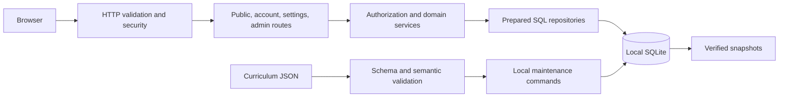

# Server architecture

Alexandria runs one Fastify process and one local SQLite database. The production process serves the built React client and API at the same origin; Vite proxies `/api` and `/health` during development. This implementation establishes accounts, catalog management, published curriculum reads, and sparse progress storage. Explicit content commands validate and import curriculum JSON; the included C++ Basics root contains six short modules.



## Code boundaries

| Location | Responsibility |
| --- | --- |
| `server/app.ts` | Compose the application, connection, services, hooks, and routes |
| `server/http/` | Origin and request checks, error responses, bounded static serving |
| `server/routes/` | HTTP validation, authentication/authorization, response status |
| `server/auth/` | Password hashing, sessions, login throttling, account and settings persistence |
| `server/services/catalog.ts` | Catalog rules, publication checks, optimistic revisions, transactions |
| `server/repositories/catalog.ts` | Prepared catalog queries and persistence |
| `server/db/` | Connection policy, public library read model, migrations, transactions, backups |
| `server/db/schema/` | Additive identity, curriculum, progress, and catalog SQL migrations |
| `server/commands/` | Explicit initialization, upgrades, backups, account creation/password reset |
| `server/content/` | Curriculum file discovery, validation, and transactional import |
| `content/units/` | Unit folders and module JSON, independent of application code |
| `content/schemas/` | JSON schemas for unit metadata and module definitions |
| `shared/` | Public TypeScript contracts and request validation schemas |

Request bodies are bounded to 16 KiB, validated without type coercion, and reject unknown fields. Each request receives a server-generated `X-Request-Id`. Errors include `error`, `code`, `message`, and `requestId`; internal database details stay out of client responses. SQL is parameterized. Related writes use synchronous `BEGIN IMMEDIATE` transactions; nested work uses savepoints.

## Implemented API

| Method and path | Access | Behavior |
| --- | --- | --- |
| `GET /health/live` | Public | Process liveness |
| `GET /health/ready` | Public | Migration compatibility and library read check |
| `GET /api/library` | Public | Published categories and placed published topics |
| `GET /api/topics/:slug/outline` | Public | Published unit hierarchy and module summaries; every ancestor must be visible |
| `GET /api/modules/:id` | Public | Latest published module version, structured lesson parts, objectives, and bibliographic citations |
| `POST /api/auth/login` | Public | Authenticate username/password; set session cookie; return user and CSRF token |
| `GET /api/auth/session` | Public | Current user and CSRF token, or `{ "user": null }` |
| `POST /api/auth/logout` | Signed in | Revoke current session and expire cookie |
| `GET /api/settings` | Signed in | Own saved settings or defaults at revision zero |
| `PATCH /api/settings` | Signed in | Update own preferences with expected revision |
| `GET /api/admin/categories` | Admin | Paginated catalog categories, including drafts/archived records |
| `GET /api/admin/categories/:id` | Admin | One category and revision |
| `POST /api/admin/categories` | Admin | Create category; default draft; return 201 |
| `PATCH /api/admin/categories/:id` | Admin | Update category using expected revision |
| `GET /api/admin/topics` | Admin | Paginated catalog topics and category placements |
| `GET /api/admin/topics/:id` | Admin | One topic and revision |
| `POST /api/admin/topics` | Admin | Create topic; default draft; return 201 |
| `PATCH /api/admin/topics/:id` | Admin | Update topic and optional complete placement replacement |

Lists accept `limit` (1–100, default 50), `offset` (default 0), and optional `status` (`draft`, `published`, `archived`). Responses contain `items` and `pagination`. PATCH operations require the current `revision` and at least one changed field; stale revisions return 409. Catalog creation accepts `slug`, `name`, and optional `description`/`status`; categories also accept `position`. Topic `categoryPlacements` is an array of `{ categoryId, position }`, with each category appearing once. Omitted placements on PATCH preserve existing membership. Supplied placements replace membership atomically.

A published topic must have at least one published category. A category cannot be unpublished if doing so would strand a published topic. Archive via PATCH; there is no destructive delete route. Stable IDs preserve relationships when names or placement change.

## Sessions and request protection

Accounts are provisioned by local operator commands, with `admin` and `member` roles. Password hashes use random salts and asynchronous Node scrypt (`N=32768`, `r=8`, `p=3`), bounded to two active hashes and eight waiting requests per service. Login attempts are limited by username and IP over 15-minute windows; the bounded in-memory counters reset on restart. Unknown users perform dummy password hashing and receive the same failed-login response. See [OWASP password storage guidance](https://cheatsheetseries.owasp.org/cheatsheets/Password_Storage_Cheat_Sheet.html).

Successful logins generate fresh 32-byte session secrets. SQLite stores only their SHA-256 hashes; the browser receives an HttpOnly, SameSite=Strict, Path=/ cookie with a seven-day absolute expiry. `APP_ORIGIN=https://…` adds Secure. No signing secret, email provider, external identity service, or default credentials are required. Expired sessions are rejected and cleaned during login; password reset revokes every session for that user. Disabled users cannot authenticate. Credentials and protected exercise grading specifications stay server-side.

All API mutations, including login, require `X-Alexandria-Request: 1`. Authenticated mutations additionally require `X-CSRF-Token` from login/session, plus the session cookie. Cross-site mutations and mismatched browser origins are rejected. `APP_ORIGIN`, when set, must exactly match the browser origin; otherwise mutations compare against the direct request origin. CORS is not enabled. This follows the custom-header and token approaches in [OWASP CSRF guidance](https://cheatsheetseries.owasp.org/cheatsheets/Cross-Site_Request_Forgery_Prevention_Cheat_Sheet.html).

For a signed-in browser, updating settings looks like:

```ts
const session = await fetch('/api/auth/session').then(response => response.json());
const settings = await fetch('/api/settings').then(response => response.json());
const response = await fetch('/api/settings', {
  method: 'PATCH',
  headers: {
    'Content-Type': 'application/json',
    'X-Alexandria-Request': '1',
    'X-CSRF-Token': session.csrfToken,
  },
  body: JSON.stringify({ revision: settings.revision, theme: 'dark' }),
});
// On 409, reload current settings before deciding whether to retry.
```

Settings support `theme: system | light | dark`, `textSize: small | medium | large`, and `motionPreference: system | reduced | full`. User identity comes from the session; clients cannot choose another user ID. GET creates no row. API responses use `Cache-Control: no-store`. Logging excludes request bodies, query strings, passwords, cookie values, and CSRF tokens.

## Storage and future work

SQLite runs with WAL, foreign keys, recursive triggers, FULL synchronous durability, and a five-second busy timeout. Startup checks the existing database, integrity, and checksummed migration history; it never initializes or silently upgrades storage. Runtime writes require a fully migrated schema. `db:migrate` creates a verified pre-upgrade backup and applies each pending migration transactionally. See [Getting started](getting-started.md) for setup, upgrades, and account commands, and [Database schema](database-schema.md) for constraints and relationships.

Public curriculum repositories return only published content belonging to a published topic with a published category placement. Every ancestor unit must be published. Lesson JSON is validated against bounded, explicit paragraph, code, list, callout, and reflection shapes. The client renders plain text without stored HTML or executable content. Protected exercise tables are not queried or serialized.

The content loader recursively discovers `unit.json` metadata, child unit folders, and module JSON under `content/units/`. It validates file shapes with Ajv against the checked-in JSON schemas, then checks semantic rules such as stable identities, ownership, and ordering. `content:check` validates all roots by default, or a named root, without opening the database.

`content:import -- cpp` imports one root after a verified backup, using a single transaction. It adds new units and version-1 modules, leaves exact matching records unchanged, and rejects conflicts without replacing published work. The compatibility command `content:cpp-basics` imports the C++ root through the same path. The source files contain no version-number field: the current importer only creates first releases. Publishing later releases needs an explicit future workflow; changing `versionId` alone is not an update mechanism. See [Content authoring](../content/README.md) and [C++ Basics content](cpp-basics-content.md).

Builds validate curriculum and copy the content tree to `dist/content/`. Compiled content commands locate that packaged directory relative to their own files, not the current working directory. The HTTP server reads published curriculum from SQLite. JSON source files and schemas are not bundled into the frontend or exposed as static assets.

Curriculum authoring APIs, learner progress APIs, completion policy, account UI, and exercise graders/runners are not implemented. The reader’s section counter describes location, not completion. Reflections reveal explanations without grading or saving attempts. No learner code executes in the API process. Unit/topic progress will be derived from module records; no per-user curriculum rows are preallocated. Bibliographic citations contain no source-file paths. Private source books remain outside runtime storage and backups.
