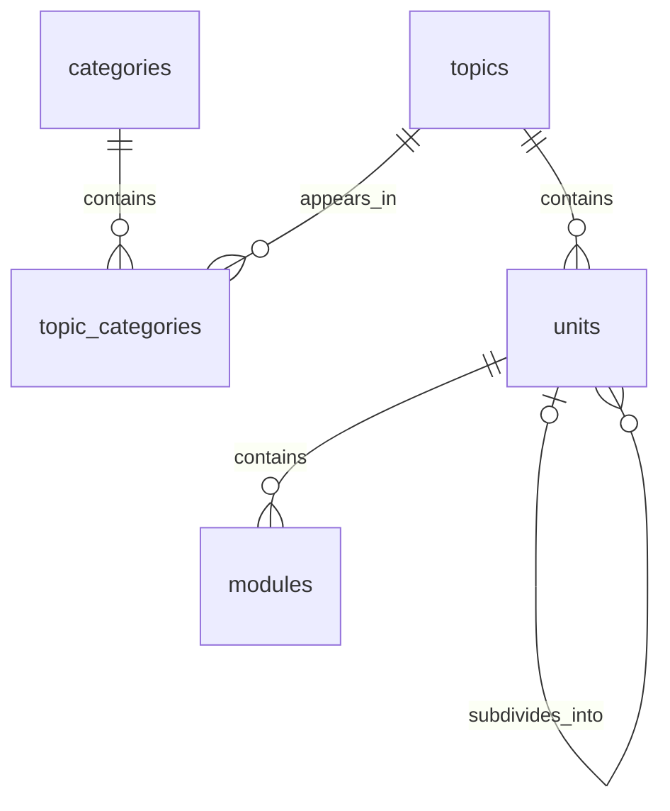

# Alexandria: Units Database Design

Status: Planning draft. The agreed terminology is **units** and **subunits**. This document proposes the catalog schema; it does not create tables or migrations.

Related: [How modules work](modules.md).

## Hierarchy and terminology

```text
Category → Topic → Unit → Subunit → Module
```

Categories organize discovery, topics represent subjects, units organize a subject, and modules contain detailed lessons and problems. Subunits are units with a parent, stored in the same table. Additional nesting is possible without adding a table per level.

Example, for illustration only:

```text
Software & Computing
  C++
    Memory management
      Ownership and lifetimes
        Understanding object lifetime
```

All subjects use shared tables. There is no separate units or modules table for each topic. Subject-specific explanations and exercises belong in module content, not in subject-specific columns on the catalog tables.

## Relationship overview



Foreign keys live on the child or association rows:

- `topic_categories.topic_id` references `topics.id`.
- `topic_categories.category_id` references `categories.id`.
- `units.topic_id` references `topics.id`.
- `units.parent_unit_id` references the parent unit when present.
- `modules.unit_id` references `units.id`.

A topic does not store an array of unit IDs. Its units are retrieved by their `topic_id`. Each module has one primary unit; placing a topic in multiple categories does not duplicate its modules or learner progress.

## Proposed tables

Use stable text IDs independent of names and slugs. Unless stated otherwise, fields are required. Exact SQL and driver-specific migration details will be finalized during implementation against local SQLite, following the [self-hosting implementation plan](../docs/self-hosting-plan.md).

### `categories`

| Column | Purpose |
| --- | --- |
| `id` | Primary key |
| `name` | Display name, such as Mathematics |
| `slug` | Unique readable identifier |
| `description` | Optional catalog description |
| `position` | Nonnegative display order |
| `status` | Draft, published, or archived |
| `created_at`, `updated_at` | Timestamps |

Categories are flat initially. Add nesting only if catalog navigation requires it.

### `topics`

| Column | Purpose |
| --- | --- |
| `id` | Primary key |
| `name` | Subject name, such as C++ |
| `slug` | Unique readable identifier |
| `description` | Topic overview |
| `status` | Draft, published, or archived |
| `created_at`, `updated_at` | Timestamps |

A topic has one identity even when it appears in several categories. Prerequisites and learner enrollment are separate relationships, not category attributes.

### `topic_categories`

| Column | Purpose |
| --- | --- |
| `topic_id` | Foreign key to the topic |
| `category_id` | Foreign key to the category |
| `position` | Nonnegative topic order within this category |

Use `(topic_id, category_id)` as the composite primary key to prevent duplicate associations. The association supports subjects such as machine learning appearing under both AI and Software & Computing. Require at least one published category association before a topic becomes discoverable in the public catalog.

### `units`

| Column | Purpose |
| --- | --- |
| `id` | Primary key |
| `topic_id` | Foreign key to the owning topic |
| `parent_unit_id` | Nullable parent; null means a top-level unit |
| `name` | Unit or subunit title |
| `slug` | Readable identifier, unique within its topic |
| `description` | Optional unit introduction |
| `position` | Nonnegative order among sibling units |
| `status` | Draft, published, or archived |
| `created_at`, `updated_at` | Timestamps |

Keeping `topic_id` on every unit simplifies retrieving a whole topic outline. Enforce that a parent belongs to that same topic. A proposed database constraint is a composite foreign key `(parent_unit_id, topic_id)` referencing a unique `(id, topic_id)` key on `units`, alongside the topic foreign key.

Disallow a unit being its own parent. Longer cycles require an ancestor check during hierarchy mutations; perform validation and the move atomically so concurrent edits cannot bypass it. Do not rely on a client-side check.

### `modules`

| Column | Purpose |
| --- | --- |
| `id` | Stable module primary key |
| `unit_id` | Foreign key to its primary unit |
| `title` | Module title |
| `slug` | Readable identifier, unique within its unit |
| `summary` | Optional short description for the outline |
| `position` | Nonnegative order among modules in this unit |
| `is_required` | Whether the module counts toward required completion |
| `status` | Draft, published, or archived |
| `created_at`, `updated_at` | Timestamps |

Module content versions, exercises, submissions, and account progress belong in separate tables described conceptually in the module notes. A module's topic is derived through its unit; avoid a redundant `topic_id` unless a demonstrated query need justifies it.

## Ordering and outline behavior

- Order siblings by `position`, with `id` as a deterministic tie-breaker.
- Positions need not be contiguous or globally unique.
- Reordering updates positions, never identity or learner attempt records.
- The proposed schema permits a unit to contain both modules and child units. Initially, display its direct modules first, followed by child units; their position values are independent.
- Arbitrary interleaving of modules and child units would require a unified ordering model. That is outside this initial proposal.
- Module links should include stable IDs so renaming or moving content does not inherently break bookmarks.

## Integrity and lifecycle rules

1. Enforce foreign keys on every SQLite connection, including migration connections, and verify enforcement in integration checks.
2. Validate statuses and nonnegative positions.
3. Reject cycles and parent units from another topic.
4. Use restrictive deletion for topics, units, and modules with dependents. Archive published material instead of deleting learning history.
5. A published module is publicly visible only when its topic and all ancestor units are also published. Draft previews use a separate authorized path.
6. Moving a unit within a topic preserves its ID and descendant module IDs. Cross-topic subtree moves need a dedicated operation that updates every descendant consistently; exclude them from basic editing initially.
7. Archiving a category or removing a category association does not delete its topics. Categories affect discovery, not content ownership.

## Indexes and retrieval

Proposed indexes, in addition to primary and unique keys:

| Index columns | Supports |
| --- | --- |
| `topic_categories(category_id, position, topic_id)` | Topic listing in a category |
| `units(topic_id, parent_unit_id, position, id)` | Topic outline and ordered sibling lookup |
| `units(parent_unit_id)` | Parent relationship checks and child lookup |
| `modules(unit_id, position, id)` | Ordered module listing |

For a topic overview, fetch its units and module summaries in bounded queries and assemble the tree on the server. Avoid one request per subunit. Return summaries rather than full lesson bodies; fetch module content when opened. Paginate topic discovery as the catalog grows.

## Progress integration

Progress belongs to users and stable module identities, with attempts referencing the assessed content version. It does not belong on the shared `units` rows.

Calculate unit completion from required modules in that unit and its descendants. Calculate topic completion from its required modules, counting each once. Do not average subunit percentages when subunits have different numbers of modules. Empty units should show no required modules rather than a misleading completion percentage.

Historical completion remains distinct from current curriculum coverage. Adding, moving, or archiving required modules can change the current denominator; the exact achievement policy remains open, as noted in the module document.

## UI mapping

- **Explore:** categories, search, and topic cards.
- **Topic overview:** units, expandable subunits, and module summaries.
- **Module view:** breadcrumbs and a topic outline; a drawer on mobile and an optional persistent sidebar on desktop.
- **My learning:** active topics and a direct resume action.

Multiple category placements should not create competing breadcrumb identities. Within learning views, use the topic as the stable starting point.

## Validation scenarios for implementation

- A topic can appear in two categories without duplicate modules or progress.
- A unit can contain subunits with their own modules.
- Cycles and cross-topic parent relationships are rejected.
- Renaming and reordering preserve stable IDs and saved progress.
- Draft ancestors prevent descendant modules from appearing publicly.
- Units of different sizes contribute correctly to topic progress.
- Removing catalog placement never cascades into learner history.

## Remaining decisions

- Whether mixed modules and child units need interleaving beyond the proposed grouped display.
- Any maximum nesting depth enforced by the authoring UI.
- Rules for required curriculum changes and historical completion.
- Detailed schemas for module versions, assessment, prerequisites, and user progress.
